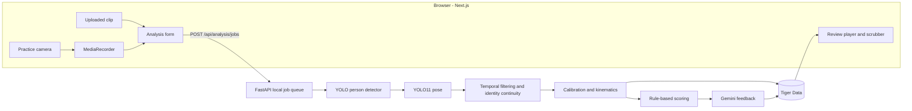

# Dive Form Analyzer: Implementation Plan

## Goal

Support two local workflows with one pose stack:

1. **Practice camera:** record a dive and return feedback after the recording ends.
2. **Uploaded footage:** analyze an existing clip at higher quality and review it with precise timeline controls.

This is a coaching aid, not certified judging. All measurements are two-dimensional estimates from a static side camera.

## Model architecture

The backend owns all inference. A two-stage top-down pipeline runs on every source frame:

1. YOLO11 person detection inside the configured flight-path region.
2. Motion association chooses the diver using the prior center-of-mass trajectory.
3. The selected box receives 30% padding before YOLO11m-Pose estimates 17 COCO keypoints.
4. A constant-acceleration Kalman filter runs independently for every joint.
5. Low-confidence measurements are rejected and short gaps are predicted; longer gaps become missing.
6. Temporal left/right assignment reduces label swaps during inversion and self-occlusion.

The `fast` profile uses 640-pixel inference for post-dive practice feedback. The `quality` profile uses 960-pixel inference for uploaded review. A single serialized local worker keeps one detector/pose pair warm and avoids GPU-memory contention. Remote GPU processing is intentionally deferred.

## Architecture

## Calibration

The user marks the board tip and visible water surface in normalized video coordinates. Their vertical separation represents the fixed 1 m springboard height and provides pixels per meter. No athlete name or body-height profile is required. The analysis library also supports a loose flight-path ROI; until the browser exposes ROI drawing, the full frame is used.

## Continuity and entry handling

- Confidence below `0.4` is treated as an occlusion, not a valid coordinate.
- Joint prediction is capped at `0.35 s`; diver-box prediction is capped at `0.45 s`.
- Predicted points remain distinguishable from measured points throughout storage and rendering.
- Entry starts when a post-apex extremity crosses the calibrated surface while the center of mass is descending.
- After entry, skeleton segments are clipped geometrically at the surface. Visible joints above water continue to render; submerged endpoints are not fabricated through splash and refraction.

## Kinematics and scoring

- **Takeoff:** board depression, hurdle height, knee/hip extension, torso lean, and horizontal/vertical velocity.
- **Flight:** calibrated apex height, horizontal travel, board clearance, tuck/pike tightness, knee separation, and angular velocity/rotation.
- **Entry:** body-axis deviation from vertical, body-line straightness, arm alignment, and entry velocity.
- **Verification:** fit center-of-mass flight to a ballistic parabola and report fit quality.

The API stores COCO-17 landmarks as `17 × (x, y, z, confidence)`, model/profile metadata, phase frames, metrics, scores, and coaching feedback.

## User experience

- `/record` separates **Practice camera** and **Upload video** clearly.
- Calibration controls use explicit labels, completion states, and keyboard-visible focus styles.
- Analysis progress reports stage, percentage, and processed frames.
- `/dives/[id]` uses one review component for both sources, with play/pause, frame stepping, playback speed, and scrubbing.
- Skeleton color communicates confidence; predicted joints are dashed and uncertain.

## Verification

- Unit-test filtering, left/right correction, water clipping, kinematics, and synthetic inverted/tuck sequences.
- API-test job validation, queue state, unsupported media, cancellation, and existing review endpoints.
- Type-check, lint, and production-build the frontend.
- Search source, dependencies, generated assets, and documentation to ensure only the YOLO stack remains.

## Known limits

- A side camera cannot reliably measure twist or motion toward the lens.
- No model can guarantee perfect per-limb alignment through complete occlusion or severe blur; predictions must remain visibly labeled.
- Reflections and splash can obscure the true water boundary. Clipping at the calibrated line avoids pretending submerged coordinates are observations.
- Local CPU analysis may take longer than clip duration. Apple MPS or CUDA improves turnaround without network upload latency.
