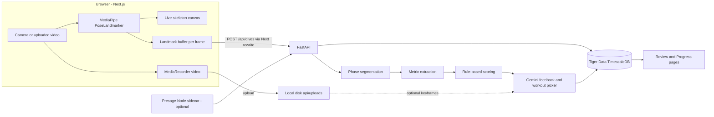

# Dive Form Analyzer: Plan

A web app that records a diver with the browser camera, tracks their pose live with MediaPipe, and scores takeoff, flight and entry after each dive. Rule-based metrics feed the Gemini API, which writes coaching feedback and picks workouts from a curated library. Tiger Data (TimescaleDB) stores the pose time series and progress history, and Presage is an optional add-on for a pre-dive heart-rate and breathing check.

## 1. Goal and scope

Build a web app that does four things:

1. Records a diver from a phone or laptop camera and shows a live skeleton overlay on the video. A pre-recorded video can be uploaded instead, which is how we test without a pool.
2. After each dive, splits the recording into phases (takeoff, flight, entry) and computes form metrics for each phase.
3. Turns those metrics into a score and plain-language feedback.
4. Suggests dryland workouts that target the diver's weakest areas, and tracks progress across sessions.

This is a coaching aid, not official World Aquatics judging. The scores are approximations based on joint angles.

## 2. Tech choices

**Frontend: Next.js (React, TypeScript) with Tailwind**
- Camera capture through `getUserMedia`, recording through `MediaRecorder`.
- Live pose tracking with `@mediapipe/tasks-vision` `PoseLandmarker`, running on the GPU through WebGL in the browser. It returns 33 body landmarks per frame. The "full" model drives the live overlay; the more accurate "heavy" model re-runs frame by frame over uploaded videos.
- The MediaPipe wasm files and model weights are served from our own `public/` folder (copied or downloaded at `npm install`), so a flaky venue network can't break the demo.
- The skeleton is drawn on a `<canvas>` layered over the video.
- The browser only talks to its own origin. Next.js forwards `/api/*` to FastAPI (a rewrite), so no API address or key is ever in browser code. It also means a phone can use the app over HTTPS on the local network without mixed-content errors.

**Backend: Python FastAPI**
- Takes the per-frame landmarks and dive metadata, runs signal processing with `numpy` and `scipy` (smoothing, phase detection, angle and velocity calculations), scores the dive, and calls Gemini.
- Python keeps the door open for re-running a stronger pose model on the server later.

**Database: Tiger Data (managed TimescaleDB, which is Postgres with time-series extensions)**
- A good fit because each dive produces a dense time series of landmark positions over time.
- The per-frame landmarks go in a hypertable (Timescale's automatically time-partitioned table), and so do the per-dive metrics.
- A continuous aggregate (an automatically refreshed rollup) of daily metric averages powers the Progress charts. It runs in real-time mode, so a dive shows up immediately rather than after the next refresh.
- Optional: `pgvector` embeddings of each dive's metric profile, so the app can find the most similar reference dive or a past dive.

**LLM: Google Gemini API, called through the `google-genai` Python SDK**
- Default model `gemini-3.8-flash` (the current stable Flash model), overridable with `GEMINI_MODEL`.
- Called through the Interactions API (`client.interactions.create`) with `thinking_level="low"` for speed. Gemini 3 models no longer accept `temperature`, so we don't send it.
- Structured output: `response_format` carries the JSON schema of a Pydantic model, so the reply always parses into `summary`, `faults`, `cues` and `workouts`.
- The prompt includes the computed metrics and the fixed workout catalog, and the schema limits workout IDs to the catalog (an enum), so Gemini can't invent drills. The server filters the IDs again anyway.
- `store=False`, so Google doesn't keep the interaction.
- If the Gemini call fails (network, quota), the app falls back to feedback built from the rule-based faults, so a dive always gets a result.
- Optional vision pass: Gemini accepts images and video. Send three keyframes (takeoff, apex, entry) with the skeleton drawn on, so it can catch faults the angle metrics miss, such as a head position or a splash. Its comments are an add-on to the rule-based scores and never replace them.
- The API key stays on the FastAPI server (`GEMINI_API_KEY`) and is never sent to the browser.

**Presage (SmartSpectra SDK): optional stretch goal**
- Presage measures heart rate and breathing rate from a camera without anything worn on the body.
- It needs the face and upper chest visible, well lit and still, for about 30 seconds, so it cannot run during a dive.
- Use it for a "readiness check" before a set (resting heart rate, breathing) and a recovery check after a workout. Store the readings in Tiger Data alongside the dives.
- There is no browser SDK. The SDKs are iOS, Android, C++ and Node.js (`@smartspectra/node-sdk`, which supports Apple Silicon Macs). So the integration is a small Node sidecar service: either it opens the laptop camera itself (`useCamera()`), or the browser streams frames to it (`useCustomInput()` and `sendFrame()`). Readings are then saved through FastAPI.

### Pose model options

- **MediaPipe BlazePose (used in the MVP):** fast, runs in the browser, easy to set up. It can lose track of the body when the diver is upside down, tucked tight, blurred by motion, or in the splash.
- **RTMPose / ViTPose (upgrade path):** more accurate and handles unusual body positions better, but needs a server GPU. Could be run on the uploaded video after the dive for a more precise second pass.
- **YOLO11-pose:** handles multiple people and is robust, but is less useful here since there is only one diver.

The analysis code only sees a list of timestamped landmarks, so a server-side model can be swapped in later without changing it.

## 3. Architecture



## 4. Filming setup and calibration

The accuracy of every metric depends on camera placement, so the app guides the user through it:

- Mount the camera on a tripod, side-on and perpendicular to the board, framing the board through to the water surface. Use 60 fps if the device supports it.
- Scale comes from the diver's height (entered once). The backend measures the diver's shoulder-to-hip, hip-to-knee and knee-to-ankle segments in pixels and compares them with standard body proportions, so no measuring tape or board taps are needed.
- On a paused frame, the user can optionally tap the board tip (the reference for jump height and board distance) and the water line (used to detect entry). Without a water line, entry falls back to the board height times the scale, then to the moment the hips drop back to takeoff level (which also makes a jump in a room work for demos).
- The user picks a dive: position (straight, pike, tuck, or free), direction (forward, back, reverse, or inward), number of somersaults, and board height. This decides which rules apply.

## 5. Analysis pipeline (backend)

1. **Clean the data:** drop landmarks the model isn't confident about, fill short gaps by interpolation, resample onto an even time grid (live capture isn't evenly spaced), and smooth with a Savitzky-Golay filter (a standard smoothing filter that preserves peaks).
2. **Split into phases:**
   - Takeoff is the peak upward velocity of the hip midpoint before the apex.
   - The apex is the highest point of the hips.
   - Entry is when the lowest body point reaches the water line, or one of the fallbacks above.
3. **Compute metrics for each phase:**
   - Takeoff: knee and hip extension at the moment of leaving the board, arm position, and forward lean of the torso.
   - Flight: jump height (hip apex above takeoff), horizontal travel and closest distance to the board tip (a safety check), tightness of the tuck or pike (hip and knee angles), knees kept together, pointed toes (knee-ankle-toe angle, limited by MediaPipe's foot points), and total rotation.
   - Entry: angle from vertical, how straight the shoulder-hip-ankle line is, and arms in line with the body for head-first entries. Splash is left to the optional Gemini vision pass because angle data can't see it.
4. **Score:** each metric gets a target and a tolerance for the chosen dive position. The gap from target turns into a deduction, modelled loosely on judges' deductions. The result is a score out of 10 for each phase and overall.
5. **Feedback:** send the metrics JSON and the top faults to Gemini, optionally with the keyframes, and get structured output back:
   - `faults[]`: a summary, the phase it happened in, and the timestamp.
   - `cues[]`: short coaching phrases.
   - `workouts[]`: IDs chosen only from the catalog, with a reason for each.

## 6. Workout catalog

A seed JSON file (`api/data/workouts.json`) that maps each fault to drills, with sets, reps, and a short description. Examples:

- Loose tuck or pike: V-ups, hanging knee raises, pike compression lifts, seated pike stretch.
- Body line breaks at entry: hollow body holds, handstand holds against a wall, streamline wall sits.
- Weak toe point: resistance-band ankle pointing, and sitting on the heels to stretch the tops of the feet.
- Low jump height: box jumps, squat jumps, calf raises, board-hurdle drills on land.
- Slow rotation: dryland somersaults on a trampoline or mat, and tuck-snap drills.
- Too close to or too far from the board: standing jumps with a target line, and practising arm-swing timing.

## 7. Data model (Tiger Data)

- `divers` (id, name, height_cm)
- `sessions` (id, diver_id, started_at, readiness_hr, readiness_br)
- `dives` (id, session_id, diver_id, recorded_at, dive setup, video path, fps, calibration JSON, scores JSON, feedback JSON, analysis JSON)
- `pose_frames`, a hypertable on `ts` (dive_id, ts, frame_idx, t, landmarks as a float array of 33x4 values)
- `dive_metrics`, a hypertable on `recorded_at` (dive_id, diver_id, phase, metric, value, score)
- `daily_metric_avg`, a real-time continuous aggregate over `dive_metrics` for the Progress charts.
- `workouts` (id, name, targets, description, sets, reps), seeded from the catalog.

## 8. Pages

- `/record`: pick the dive, calibrate, then either a live camera view with the skeleton overlay and big Start/Stop buttons, or an uploaded video analysed frame by frame. Auto-stop once the diver enters the water is a stretch goal.
- `/dives/[id]`: slow-motion video with the skeleton overlay, a timeline marking takeoff, apex and entry, charts of joint angles over time, a score card, feedback cues, and recommended workouts.
- `/progress`: score and metric trends over time, drawn from the continuous aggregate.
- `/readiness` (optional): the Presage check before a set.

## 9. Secrets and API keys

- All secrets go in `.env` files that are never committed:
  - `GEMINI_API_KEY`
  - `DATABASE_URL`, the Tiger Data connection string, which includes the password
  - `PRESAGE_API_KEY`, if we use Presage
- A root `.gitignore` is created before any code or keys. It covers:
  - `.env`, `.env.*` and `*.local`, with an exception (`!.env.example`) so the template still gets committed
  - `node_modules/`, `.next/`, `.venv/`, `__pycache__/`, `.DS_Store`
  - Sample videos and uploaded recordings, which may contain footage of real people
- A `.env.example` with placeholder values is committed so teammates know which variables to set.
- The backend loads its variables with `pydantic-settings` and refuses to start if a required key is missing.
- Every secret stays on the server. In Next.js, anything prefixed `NEXT_PUBLIC_` gets bundled into the browser code, so nothing uses that prefix. The only web setting, `API_URL` (where FastAPI runs), is read by the Next.js server for its rewrite and never reaches the browser.
- Never log keys or put them in error messages.
- Before the first commit, confirm the setup with `git check-ignore .env` and `git status`. Optionally add a pre-commit secret scanner such as `gitleaks`.
- If a key is ever committed by accident, revoke it and issue a new one right away. Rewriting git history is not enough on its own.

## 10. Repo layout

```
owlhacks-2026/
  .gitignore
  .env.example              # committed placeholders; the real .env stays ignored
  PLAN.md
  web/                      # Next.js app
    app/record/page.tsx
    app/dives/[id]/page.tsx
    app/progress/page.tsx
    lib/pose/landmarker.ts  # MediaPipe setup
    lib/pose/draw.ts        # skeleton overlay
  api/                      # FastAPI
    main.py
    config.py               # pydantic-settings; loads and validates the .env variables
    analysis/smoothing.py
    analysis/phases.py
    analysis/metrics.py
    analysis/scoring.py
    feedback/gemini.py      # google-genai client, prompt, Pydantic response schema
    data/workouts.json
    db/schema.sql
  samples/                  # test dive videos and exported landmark JSON
```

## 11. Build order (hackathon milestones)

0. `.gitignore`, `.env.example` and the settings loader are in place before any keys exist.
1. The browser camera, MediaPipe live overlay, and recording all work end to end.
2. Landmarks export to JSON, and the analysis runs offline on sample dive videos from YouTube or ones you film yourself.
3. Phase splitting and metrics are correct for straight and tuck dives.
4. Scoring, Gemini feedback, and the workout catalog are in place, and the review page is built.
5. Tiger Data persistence and the Progress page are working.
6. Stretch goals: a Gemini vision review of keyframes, the Presage readiness check, a server-side second pass with RTMPose, comparison against a reference dive using pgvector, and auto-stop on entry.

## 12. Risks

- Pose tracking can fail during fast somersaults and twists. Mitigations: higher frame rates, filling gaps between confident frames, and reporting which frames had low confidence.
- A single side-on camera can't see twists or sideways lean well. Accept this for the MVP and treat twisting dives as out of scope.
- Splash and reflections at entry confuse the model. Stop analysing at the water line.
- Pool deck lighting and backlight can make tracking unreliable. Add guidance to the calibration screen.
